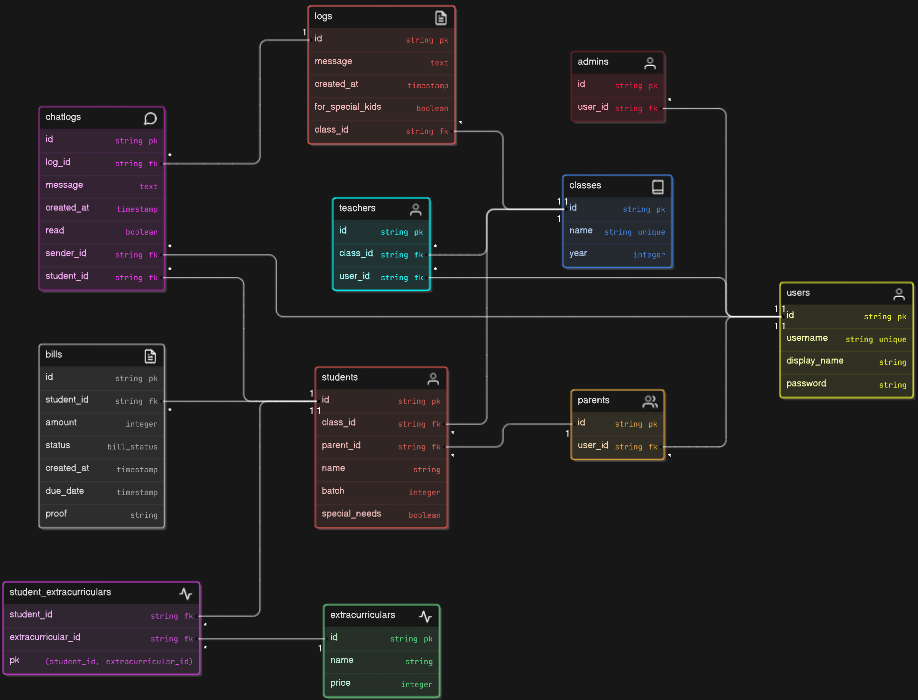

# Backend API Documentation
Backend untuk sekolah bukom (buku kominikasi) sekolah bhinekas. Bukom sendiri berfungsi untuk menghubungkan orang tua dan guru mengenai kegiatan anak di dalam sekolah. Berikut link untuk frontend
https://github.com/kamalMakarim/FE-Bhinekas
## Table of Contents
- [Introduction](#introduction)
- [Routes](#routes)
  - [Admin Routes](#admin-routes)
  - [Chat Routes](#chat-routes)
  - [Log Routes](#log-routes)
  - [Teacher Routes](#teacher-routes)
  - [User Routes](#user-routes)
- [Controllers](#controllers)
  - [Admin Controller](#admin-controller)
  - [Chat Controller](#chat-controller)
  - [Log Controller](#log-controller)
  - [Teacher Controller](#teacher-controller)
  - [User Controller](#user-controller)
- [Setup](#setup)
- [Usage](#usage)

## Introduction

This documentation covers the backend API routes for the project. The API is built using Express.js and provides routes for managing users, chat logs, logs, students, teachers, and parents.
## Table Diagram

## Routes

### Admin Routes
- **POST `/admin/addUser`**
  - Adds a new user with a specified role.
  
- **GET `/admin/getStudents`**
  - Retrieves a list of students with optional filters.
  
- **GET `/admin/getTeachers`**
  - Retrieves a list of teachers.
  
- **GET `/admin/getParents`**
  - Retrieves a list of parents.
  
- **GET `/admin/getAllKelas`**
  - Retrieves a list of all classes.
  
- **GET `/admin/getAllExtracurriculars`**
  - Retrieves a list of all extracurricular activities.

### Chat Routes
- **GET `/chat/getChatLogs`**
  - Retrieves chat logs.
  
- **POST `/chat/postChatLog`**
  - Posts a new chat log.

### Log Routes
- **GET `/log/getLogs`**
  - Retrieves logs.
  
- **POST `/log/postLog`**
  - Posts a new log.

### Teacher Routes
- **GET `/teacher/getMystudents`**
  - Retrieves a list of students for a specific teacher.

### User Routes
- **POST `/user/login`**
  - Logs in a user.

## Controllers

### Admin Controller
- **`addUser(req, res)`**
  - Adds a new user with a specified role.
  
- **`getStudents(req, res)`**
  - Retrieves a list of students with optional filters.
  
- **`getTeachers(req, res)`**
  - Retrieves a list of teachers.
  
- **`getParents(req, res)`**
  - Retrieves a list of parents.
  
- **`getAllClasses(req, res)`**
  - Retrieves a list of all classes.
  
- **`getAllExtracurriculars(req, res)`**
  - Retrieves a list of all extracurricular activities.

### Chat Controller
- **`getChatLogs(req, res)`**
  - Retrieves chat logs.
  
- **`postChatLogs(req, res)`**
  - Posts a new chat log.

### Log Controller
- **`getLogs(req, res)`**
  - Retrieves logs.
  
- **`postLog(req, res)`**
  - Posts a new log.

### Teacher Controller
- **`getMystudents(req, res)`**
  - Retrieves a list of students for a specific teacher.

### User Controller
- **`login(req, res)`**
  - Logs in a user.

## Setup

1. Clone the repository:
   ```bash
   git clone <repository-url>
   cd <repository-directory>
   ```

2. Install dependencies:
   ```bash
   npm install
   ```

3. Set up environment variables by creating a `.env` file:
   ```env
   DB_HOST=<database_host>
   DB_USER=<database_user>
   DB_PASS=<database_password>
   DB_NAME=<database_name>
   ```

4. Start the server:
   ```bash
   npm start
   ```

## Usage

The backend API can be accessed at `http://localhost:<port>`. Use the provided routes to interact with the API.

### Example Requests

- **Add User**
  ```bash
  POST /admin/addUser
  {
    "username": "teacher1",
    "password": "password1",
    "display_name": "Teacher One",
    "role": "teacher"
  }
  ```

- **Get Students**
  ```bash
  GET /admin/getStudents?student_class_id=1&batch=2023
  ```

- **Login User**
  ```bash
  POST /user/login
  {
    "username": "admin1",
    "password": "password1"
  }
  ```

This documentation provides an overview of the available routes and their usage. For detailed information on each route, refer to the respective controller methods.